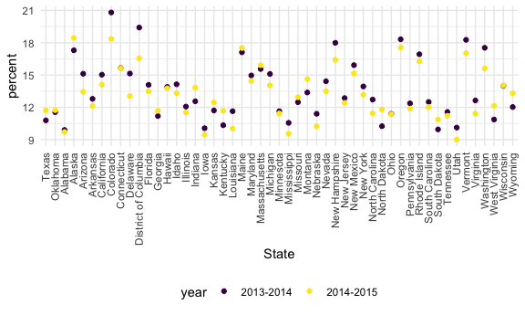
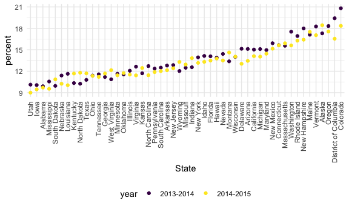

Reading data from the web
================

## strings and regex

``` r
string_vec = c("my", "name", "is", "jeff")

#detect a particular pattern (str_detect)
str_detect(string_vec, "jeff")
```

    ## [1] FALSE FALSE FALSE  TRUE

``` r
str_detect(string_vec, "e") #doesn't have to match whole pattern
```

    ## [1] FALSE  TRUE FALSE  TRUE

``` r
str_detect(string_vec, "Jeff")
```

    ## [1] FALSE FALSE FALSE FALSE

``` r
string_vec = c("my", "name", "is", "jeff")
str_replace(string_vec, "jeff", "Jeff")
```

    ## [1] "my"   "name" "is"   "Jeff"

``` r
string_vec = c(
  "i think we all rule for participating",
  "i think i have been caught",
  "i think this will be quite fun",
  "it will be fun, i think"
)

str_detect(string_vec, "i think")
```

    ## [1] TRUE TRUE TRUE TRUE

``` r
# detect strings that start w/ i think
str_detect(string_vec, "^i think") #^ = starts with
```

    ## [1]  TRUE  TRUE  TRUE FALSE

``` r
str_detect(string_vec, "i think$") #$ = ends with
```

    ## [1] FALSE FALSE FALSE  TRUE

``` r
string_vec = c(
  "Y'all remember Pres. HW Bush?",
  "I saw a green bush",
  "BBQ and Bushwalking at Molonglo George",
  "BUSH -- LIVE IN CONCERT!!"
)

str_detect(string_vec, "bush")
```

    ## [1] FALSE  TRUE FALSE FALSE

``` r
str_detect(string_vec, "Bush")
```

    ## [1]  TRUE FALSE  TRUE FALSE

``` r
str_detect(string_vec, "[Bb]ush") #lower or uppercase B
```

    ## [1]  TRUE  TRUE  TRUE FALSE

``` r
string_vec = c(
  '7th inning stretch',
  '1st half soon to begin. Texas won the toss.',
  'she is 5 feet 4 inches tall',
  '3AM - cant sleep :('
  )

# choose ranges
str_detect(string_vec, "^[0-9][a-zA-Z]")
```

    ## [1]  TRUE  TRUE FALSE  TRUE

``` r
string_vec = c(
  'Its 7:11 in the evening',
  'want to go to 7-11?',
  'my flight is AA711',
  'NetBios: scanning ip 203.167.114.66'
)

str_detect(string_vec, "7.11") #. = special char that matches anything
```

    ## [1]  TRUE  TRUE FALSE  TRUE

``` r
str_detect(string_vec, "7\\.11") #interpret . as actual . w/ \\
```

    ## [1] FALSE FALSE FALSE  TRUE

## Factors

``` r
factor_vec = factor(c("male", "male", "female", "female"))

as.numeric(factor_vec)
```

    ## [1] 2 2 1 1

what happens if i relevel?

``` r
factor_vec = fct_relevel(factor_vec, "male") # male = first or reference
as.numeric(factor_vec)
```

    ## [1] 1 1 2 2

## NSDUH – strings

``` r
url = "http://samhda.s3-us-gov-west-1.amazonaws.com/s3fs-public/field-uploads/2k15StateFiles/NSDUHsaeShortTermCHG2015.htm"

tabl_marj =
  read_html(url) %>% 
  html_nodes(css = "table") %>% 
  first() %>%  #extract first table, also available 'nth' 'last'
  html_table() %>% 
  slice(-1) %>% 
  as_tibble()
```

``` r
data_marj =
  tabl_marj %>% 
  select(-contains("P Value")) %>% 
  pivot_longer(
    -State, 
    names_to = "age_year",
    values_to = "percent"
  ) %>% 
  separate(age_year, into = c("age", "year"), sep = "\\(") %>% 
  mutate(
    year = str_replace(year, "\\)", ""),
    percent = str_replace(percent, "[a-c]$", ""),
    percent = as.numeric(percent)
) %>% 
  filter(!State%in%c("Total U.S.", "Northeast", "Midwest", "South", "West"))
```

## NSDUH – factors

``` r
data_marj %>% 
filter(age == "12-17") %>%
mutate(State = fct_relevel(State, "Texas", "Oklahoma")) %>% #convert state to factor
ggplot(aes(x = State, y = percent, color = year)) +
geom_point() +
theme(axis.text.x = element_text(angle = 90, vjust = 0.5, hjust = 1))
```



``` r
data_marj %>% 
filter(age == "12-17") %>%
mutate(State = fct_reorder(State, percent)) %>% #arrange from lowest to highest percent
ggplot(aes(x = State, y = percent, color = year)) +
geom_point() +
theme(axis.text.x = element_text(angle = 90, vjust = 0.5, hjust = 1))
```


